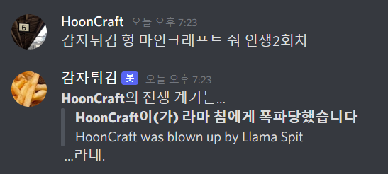

# 감자튀김 디스코드 봇

&nbsp;   
HoonKun(@hoon_kiwicraft) 가 심심해서 만든 디스코드 봇이에요.   
typescript 를 사용해, nodejs 서버 구축 플랫폼과 Discord.js 라이브러리를 사용해서 제작되었습니다.   
&nbsp;   
기능들이 많아서 하나의 단어로 정의내리기 어렵지만 대충 심심할 때 쓸 수 있는 봇이에요.   
자세한 내용은 아래 내용을 참고해주세요!!

## 명령 목록
기본적으로 해당 봇은 [ **!!** | **감튀야** | **감자튀김 형** ]으로 시작하는 메시지에 반응합니다.   
아래의 명령어는 '!!'을 사용한 경우이고, 대신 '감튀야' 혹은 '감자튀김 형'으로 입력해도 됩니다.   
도움말이나 이 문서에 표시되지 않은 시작 문구도 있으므로 찾아보시는것도 좋겠죠!!   
- **!!** [ **개발** | **멍발** ] : '개발' 커맨드에 대한 도움말을 출력합니다.
    - **!! ...** [ **저장소이름지어줘** ] : 깃 저장소 이름을 추천해줍니다. ~~사실상 아무말이나 다름 없는~~
- **!!** [ **마인크래프트** | **마크** | **マイクレ** ] : '마인크래프트' 커맨드에 대한 도움말을 출력합니다.
    - **!! ...** [ **줘** | **내놔** ] : '마인크래프트' 커맨드 기능 중 '줘(GET)' 커맨드에 대한 도움말을 출력합니다.
        - **!! ...** [ **블럭** | **블록** ] : 마인크래프트의 블럭들 중 랜덤하게 하나를 뽑습니다.
        - **!! ...** [ **아이템** ] : 마인크래프트의 아이템 중 랜덤하게 하나를 뽑습니다.
        - **!! ...** [ **인생2회차** ] : 마인크래프트에서 볼 수 있는 사망 메시지를 만듭니다. ~~랜덤이기 때문에 던져진 계란과 싸우다가 죽을 수도 있음~~
    - **!! ...** [ **아무말해줘** ] : 영어로된 마인크래프트의 아무말(타이틀 문구)를 던집니다. 몇백개중에 하나는 한글인걸로 알고있어요.
- **!!** [ **선택봇** | **선택해줘** ] : 이 명령 뒤에 나열된 띄어쓰기로 구분된 문구들 중 하나를 랜덤하게 고릅니다.
- **!!** [ **심심해** | **놀아줘** ] : 그냥 아무말을 던집니다.
- **!!** [ **도움말** | **도와줘** | **모르겠어** ] : 전체 도움말을 출력합니다.
- **!!** [ **정보** | **뭐야** | **누구야** ] : 이 봇에 대한 간략한 정보를 출력합니다.
    **!!** ... [ **TMI** ] : 이 봇에 대한 조금 더 자세한 정보를 출력합니다.
  
중간에 대괄호로 묶어진 문자열은 명령에서 제외됩니다. 자세한 내용은 다음 내용을 참고해주세요!!   
명령 뒤에 붙일 수 있는 접미사 라는 것도 있습니다. 예를 들어 '심심해' 커맨드는 '심심해...'나 '심심해!!' 로도 입력할 수 있어요.

## 예시
- 감자튀김 형 멍발 저장소이름지어줘
- 감튀야 마인크래프트 내놔 블럭
- 감자튀김 형 마인크래프트 줘 인생2회차
- 감자튀김 형 심심해
- 감자튀김 형 심심해...
- 감튀야 선택해줘 React Vue Angular
- 감자튀김 형 선택해줘   
    [저녁은 뭘 먹는게 좋을까?]   
    버거킹 돈까스 비빔면 볶음밥 카레
- !! 뭐야

## 이상한거 시키지 말라고!!
틀린 명령을 계속 입력하면 봇이 화를 냅니다. 귀여우니까 딱히 상관은 없을거에요. (???)

## 어디서 쓰나요
현재는 개발자의 1차 지인들만 있는 서버에서 쓰고 있습니다.   
재미난 아이디어가 있다면 얼마든지 추천해주시면 추가해보도록 할게요.
